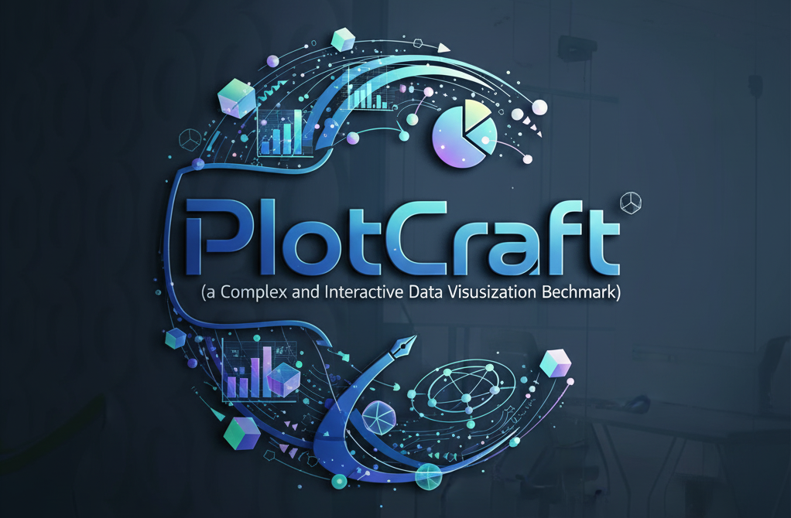

<div align="center">



</div>

<div align="center">
  
<!-- [](https://www.vgbench.com) -->
<!--  -->
[](https://arxiv.org/abs/2511.00010)
<!-- [](https://discord.gg/W89VqYhQcy) -->

</div>

---

# PlotCraft: Pushing the Limits of LLMs for Complex and Interactive Data Visualization

<p align="center">
Jiajun Zhang<sup>1, 4, †</sup>, Jianke Zhang<sup>2, †</sup>, Zeyu Cui<sup>3</sup>, Jiaxi Yang<sup>5</sup>, Lei Zhang<sup>5</sup><br>
Binyuan Hui<sup>3</sup>, Qiang Liu<sup>4</sup>, Zilei Wang<sup>1</sup>, Liang Wang<sup>4</sup>, Junyang Lin<sup>3</sup>
</p>

<p align="center">
<sup>1</sup> USTC &nbsp;&nbsp;
<sup>2</sup> THU &nbsp;&nbsp;
<sup>3</sup> Qwen Team, Alibaba Inc. &nbsp;&nbsp;
<sup>4</sup> CASIA &nbsp;&nbsp;
<sup>5</sup> SIAT<br>
<sup>†</sup> Equal Contribution
</p>

<p align="center">
📧 <b>Main Contact</b>: <code>zhangjiajun519@gmail.com</code>
</p>

<div align="center">


</div>

**PlotCraft** is a rigorous benchmark designed to evaluate the advanced data visualization capabilities of LLMs. It presents ~1k challenging tasks to assess how well models can generate and refine complex plots from natural language instructions.

**Key Features**:

* **Comprehensive Scope**: Includes 982 tasks covering 48 chart types across 8 major domains (e.g., Finance, Health, Research).
* **Dual Evaluation Modes**: The first benchmark to systematically test both:
Single-Turn Generation: From scratch, based on an initial request.
* **Multi-Turn Refinement**: Iteratively debugging and enhancing existing code.
* **Focus on Complexity**: Tasks are designed with compositional complexity, requiring multi-panel layouts and combined chart types to test a model's spatial and logical reasoning.
* **Realistic Workflow**: Built from scratch using real-world datasets and zero-reference instructions (text-only), simulating a practical data analyst workflow.

## Data and Scripts
<https://github.com/QwenLM/Qwen3-Coder/tree/main/qwencoder-eval/instruct/PlotCraft>

## Installation
```bash
git clone https://github.com/QwenLM/Qwen3-Coder.git
cd Qwen2.5-Coder/qwencoder-eval/instruct/PlotCraft
conda create -n plotcraftbench python=3.13
conda activate plotcraftbench
pip install -r requirements.txt
```

## Prepare Data

```bash
zip -F data.zip --out complete_data.zip
unzip complete_data.zip -d data
```

### Method 1: Automated Download via Kaggle API

1. **Obtain Kaggle API credentials**: Navigate to your Kaggle account settings (Account tab) and select 'Create New Token'. This downloads `kaggle.json` containing your API credentials.

2. **Configure credentials**: Move `kaggle.json` to the appropriate location:
   - Linux/macOS: `~/.kaggle/kaggle.json`
   - Windows: `C:\Users\<Windows-username>\.kaggle\kaggle.json`

3. **Install Kaggle CLI**:
```bash
pip install kaggle
```

4. **Download datasets**:
```bash
python download_datasets.py data/
```

### Method 2: Manual Download

Alternatively, download datasets manually using the URLs specified in `download_url.json` files located in each subdirectory (e.g., `data/<dataset-name>/download_url.json`). After downloading, place all CSV and XLSX files in the root of their respective subdirectories.

## Quick Start

### Configure API Credentials

Edit `run_single_turn.sh` or `run_multi_turn.sh` to set your OpenAI-compatible API endpoint and keys:

```bash
API_KEY=""          # Evaluation API key
API_KEY_GEN=""      # Generation API key
```

### Run Evaluation

**Single-Turn Mode** (generate plots from scratch):
```bash
bash run_single_turn.sh <model_name> <api_base_url>
```

**Multi-Turn Mode** (iterative refinement):
```bash
bash run_multi_turn.sh <model_name> <api_base_url>
```


Results will be saved to `results_single_turn/` (single-turn) or `results_multi_turn/` (multi-turn).


<!-- # Installation
```bash
conda create -n plotcraftbench python=3.13
conda activate plotcraftbench
pip install -r requirements.txt
```


# Quick Start
```

```

# Leaderboard -->
